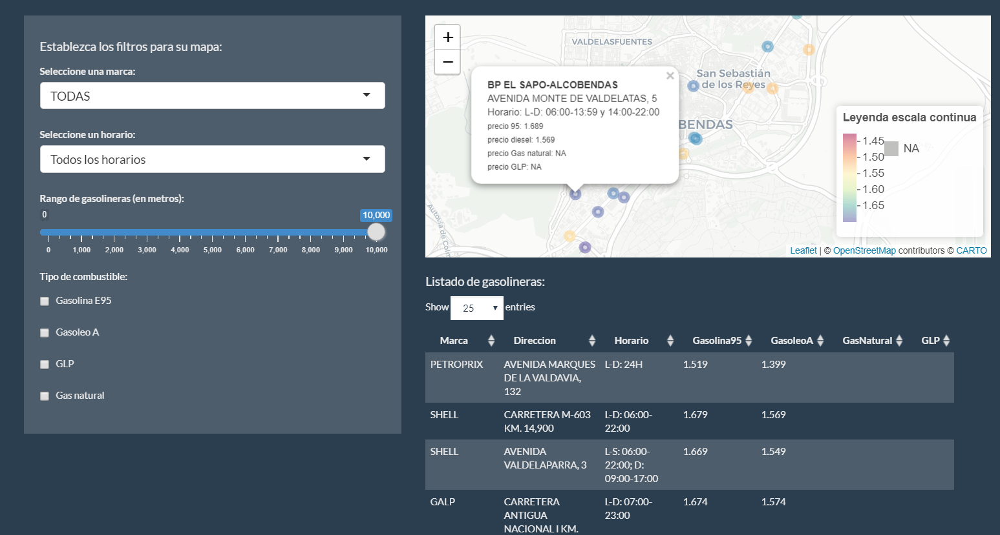

# GasApp

Aplicación que muestra los precios de las gasolineras más cercanas, actualizados diariamente y con opción para filtrar por combustible y marca. Utiliza datos del Ministerio de Industria.

Proyecto elaborado para la asignatura Lenguajes de Programación Estadística por **Rocío Colmena**, **Andrés Fernández**, **Lucas Le More**, **Lucía Núñez** y **Laura Teruel**.

**Nota**: Para ahorrar gastos hemos puesto en pausa el proyecto de Google Cloud asociado a esta aplicación, por lo que los precios no se actualizarán y la geolocalización inversa no funcionará.

